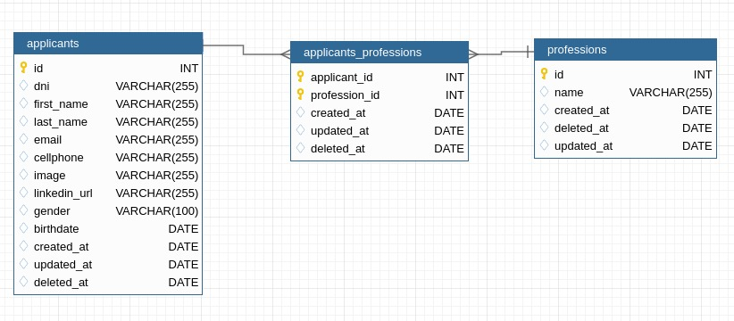

# Challenge 

##  **INTRODUCCIÓN**

*¡Descubre nuestro increíble sitio web diseñado para simplificar tu búsqueda de talento! Con un diseño llamativo y una interfaz intuitiva, nuestra página te ofrece un menú de inicio, una lista completa de aplicantes y un formulario fácil de usar para subir nuevos candidatos. ¡Encuentra a los mejores talentos con solo unos pocos clics y simplifica tu proceso de reclutamiento!*

## **INTEGRANTES DEL GRUPO**

- Gabriel Alejandro Mamani
- Micaela Zerpa
- Carolina Maria de los Angeles Cortez

## **DER**

## **DEPENDENCIAS**

### **BACKEND**

- **[@hapi/boom](https://www.npmjs.com/package/@hapi/boom):** Manejo de errores HTTP.
- **[cloudinary](https://www.npmjs.com/package/cloudinary):** Servicio de almacenamiento y manipulación de imágenes en la nube.
- **[cors](https://www.npmjs.com/package/cors):** Middleware para permitir el intercambio de recursos entre diferentes orígenes.
- **[dotenv](https://www.npmjs.com/package/dotenv):** Carga de variables de entorno desde un archivo .env.
- **[express](https://www.npmjs.com/package/express):** Framework web para Node.js.
- **[morgan](https://www.npmjs.com/package/morgan):** Middleware para el registro de solicitudes HTTP.
- **[multer](https://www.npmjs.com/package/multer):** Middleware para el manejo de formularios multipartes (subida de archivos).
- **[mysql2](https://www.npmjs.com/package/mysql2):** Cliente MySQL para Node.js.
- **[sequelize](https://www.npmjs.com/package/sequelize):** ORM (Object-Relational Mapping) para Node.js con soporte para varios dialectos de bases de datos.

- [@faker-js/faker](https://www.npmjs.com/package/@faker-js/faker): Generación de datos falsos para pruebas.
- [jest](https://www.npmjs.com/package/jest): Framework de pruebas para JavaScript.
- [nodemon](https://www.npmjs.com/package/nodemon): Utilidad para reiniciar automáticamente la aplicación Node.js cuando se detectan cambios en los archivos.
- [standard](https://www.npmjs.com/package/standard): Herramienta de formato de código JavaScript.
- [supertest](https://www.npmjs.com/package/supertest): Marco de prueba de extremo a extremo para aplicaciones HTTP.

### **FRONTEND**

- [React](https://reactjs.org/) - Biblioteca para construir interfaces de usuario.
- [React DOM](https://reactjs.org/docs/react-dom.html) - Renderizador para la web de React.
- [React Hook Form](https://react-hook-form.com/) - Librería para formularios en React.
- [React Router DOM](https://reactrouter.com/) - Librería de enrutamiento para React.
- [Yup](https://github.com/jquense/yup) - Validación de esquemas para JavaScript y TypeScript.
- [@hookform/resolvers](https://react-hook-form.com/get-started#UseFormState) - Resolver para React Hook Form.
- [Flowbite](https://flowbite.com/) - Kit de interfaz de usuario moderno y responsivo.
- [Flowbite Datepicker](https://flowbite.com/react/datepickers) - Selector de fecha para Flowbite.
- [Flowbite React](https://flowbite.com/docs/react/getting-started) - Componentes React para Flowbite.

- [Vite](https://vitejs.dev/) - Herramienta de construcción web rápida y eficiente para el desarrollo moderno de JavaScript.
- [Vite Plugin React](https://github.com/vitejs/plugin-react) - Plugin de React para Vite.
- [Tailwind CSS](https://tailwindcss.com/) - Framework de utilidades de CSS de bajo nivel.
- [PostCSS](https://postcss.org/) - Herramienta para transformar estilos con JavaScript plugins.
- [Autoprefixer](https://github.com/postcss/autoprefixer) - Complemento PostCSS para analizar los estilos y agregar prefijos de proveedores automáticamente.
- [Standard](https://standardjs.com/) - Estilo de JavaScript, TypeScript y JSON.
- [Types for React](https://github.com/DefinitelyTyped/DefinitelyTyped/tree/master/types/react) - Definiciones de tipos TypeScript para React.

## **INSTRUCCIONES PARA INICIAR EL PROYECTO**

1- Crear la base de datos en tu programa de confianza, en esta vas a cargar el script que se hallara en backend/sqlScript.
2- Ahora, en tu editor de código de confianza vas a instalar las dependencias señaladas para que el código funciones. Recuerda que Backend tiene unas y el Frontend tiene otras. 
3- Una vez instaladas las dependencias vas a acceder al backend desde la terminal, ahí vas a poner el siguiente comando: **"npm run db:seed"** para así cargar con valores nuestra base de datos. 
4- Luego, tendrás que acceder al Frontend desde la terminal y ahí usar el siguiente comando para acceder a la pagina: **"npm run dev"**